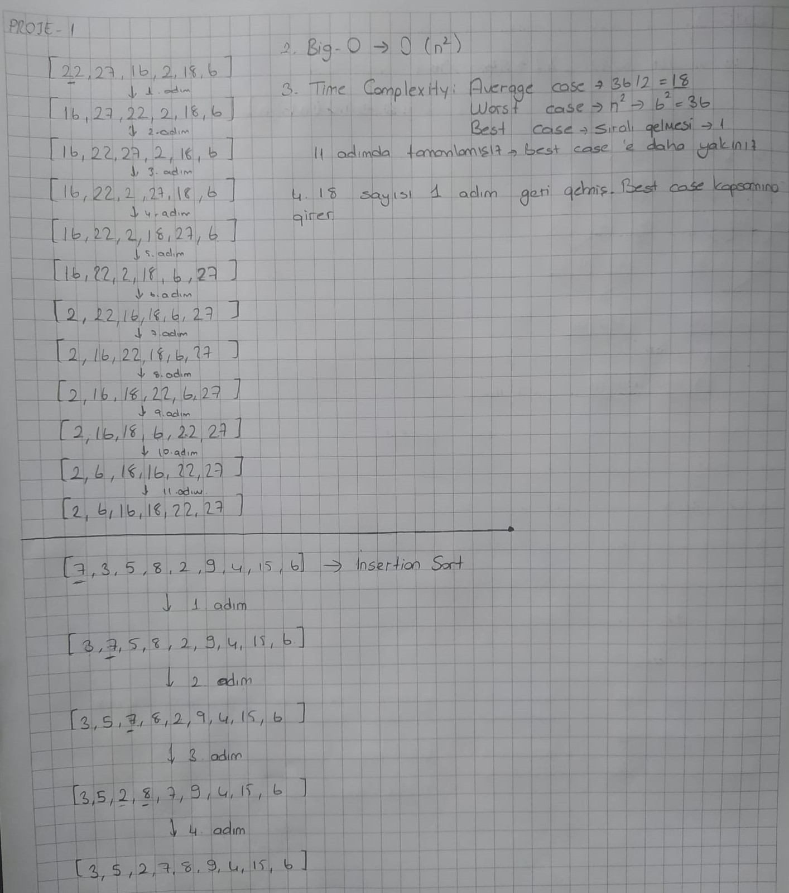
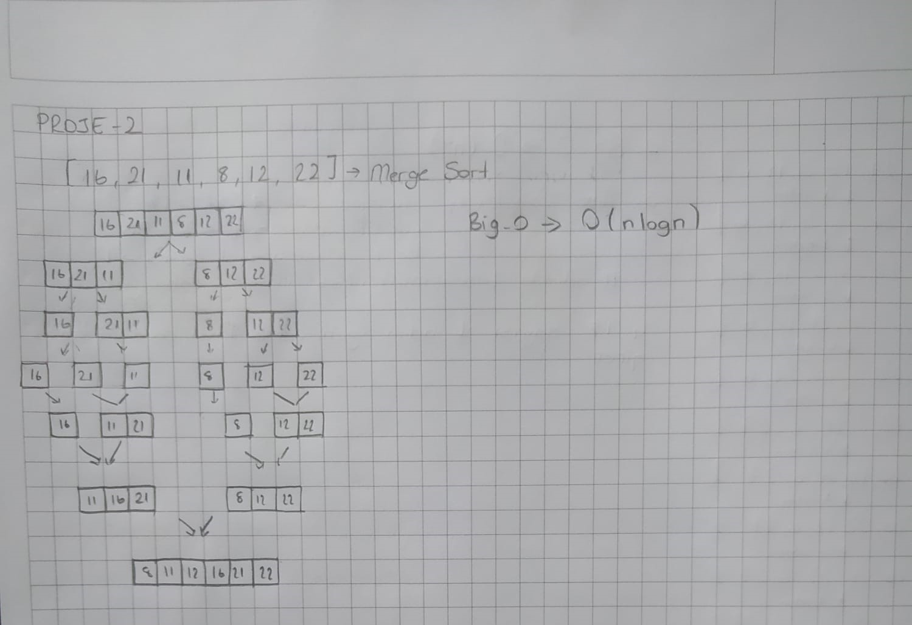
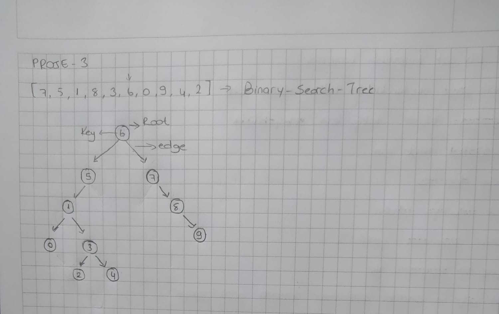

# Patikadev_projects
Patika.dev &amp; Kodluyoruz eğitimi kapsamında

Gizli patika üzerinde aldığım veri yapıları ve algoritma bölümünün sonunda bulunan proje ödevlerini içermektedir. 
[Patika](www.patika.dev) 
[Kodluyoruz](https://kodluyoruz.org/tr/kodluyoruz/)

## Project-1

[22,27,16,2,18,6] -> Insertion Sort

1- Yukarı verilen dizinin sort türüne göre aşamalarını yazınız. 
2- Big-O gösterimini yazınız. 
3- Time Complexity: Average case: Aradığımız sayının ortada olması,Worst case: Aradığımız sayının sonda olması, Best case: Aradığımız sayının dizinin en başında olması. 
4- Dizi sıralandıktan sonra 18 sayısı hangi case kapsamına girer? Yazınız.

[7,3,5,8,2,9,4,15,6] dizisinin Insertion Sort'a göre ilk 4 adımını yazınız.

### Sonuç:

## Project-2

[16,21,11,8,12,22] -> Merge Sort

- Yukarıdaki dizinin sort türüne göre aşamalarını yazınız.  
- Big-O gösterimini yazınız.

### Sonuç:

## Project-3

[7, 5, 1, 8, 3, 6, 0, 9, 4, 2] dizisinin Binary-Search-Tree aşamalarını yazınız.

Örnek: root x'dir. root'un sağından y bulunur. Solunda z bulunur vb.

### Sonuç:
